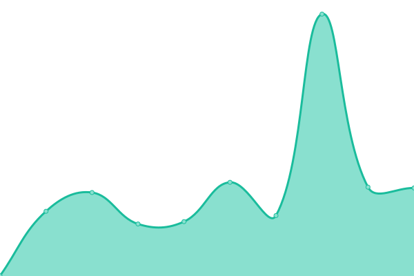
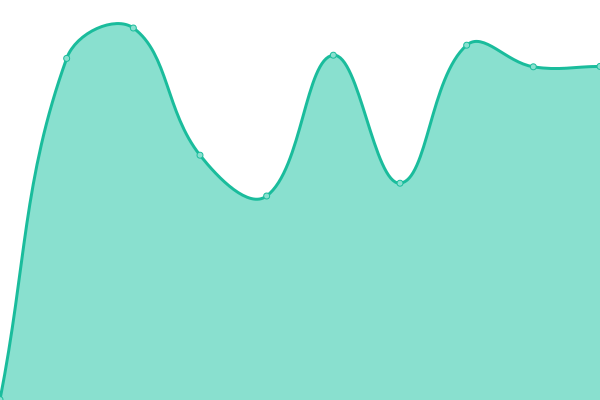
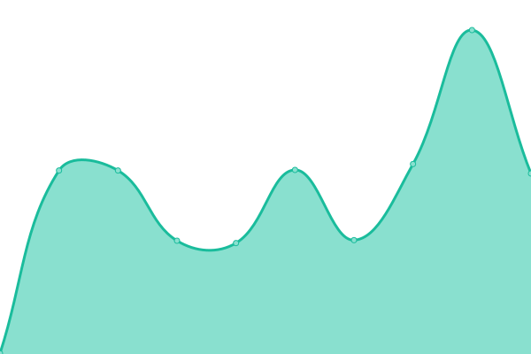

# [📈 Live Status](https://Webdeporte.github.io/statuspage): <!--live status--> **🟧 Partial outage**

This repository contains the open-source uptime monitor and status page for [Webdeporte](https://Webdeporte.github.io/statuspage), powered by [Upptime](https://github.com/upptime/upptime).

With [Upptime](https://upptime.js.org), you can get your own unlimited and free uptime monitor and status page, powered entirely by a GitHub repository. We use [Issues](https://github.com/Webdeporte/statuspage/issues) as incident reports, [Actions](https://github.com/Webdeporte/statuspage/actions) as uptime monitors, and [Pages](https://Webdeporte.github.io/statuspage) for the status page.

<!--start: status pages-->
<!-- This summary is generated by Upptime (https://github.com/upptime/upptime) -->
<!-- Do not edit this manually, your changes will be overwritten -->
<!-- prettier-ignore -->
| URL | Status | History | Response Time | Uptime |
| --- | ------ | ------- | ------------- | ------ |
|  [Ibertenis](http://ibertenis.com) | 🟩 Up | [ibertenis.yml](https://github.com/Webdeporte/statuspage/commits/HEAD/history/ibertenis.yml) | 

 552ms
     
 | 

<a href="https://Webdeporte.github.io/statuspage/history/ibertenis">100.00%</a>
    

|  [Webdeporte PRESTASHOP](http://www.webdeporte.com) | 🟩 Up | [webdeporte-prestashop.yml](https://github.com/Webdeporte/statuspage/commits/HEAD/history/webdeporte-prestashop.yml) | 

 1139ms
     
 | 

<a href="https://Webdeporte.github.io/statuspage/history/webdeporte-prestashop">100.00%</a>
    

|  [SSO](https://sso.zeltik.es/auth) | 🟩 Up | [sso.yml](https://github.com/Webdeporte/statuspage/commits/HEAD/history/sso.yml) | 

 762ms
     
 | 

<a href="https://Webdeporte.github.io/statuspage/history/sso">100.00%</a>
    

|  [ODOO twelvepadelzenter](http://188.165.243.166:8060) | 🟩 Up | [odoo-twelvepadelzenter.yml](https://github.com/Webdeporte/statuspage/commits/HEAD/history/odoo-twelvepadelzenter.yml) | 

 281ms
     
 | 

<a href="https://Webdeporte.github.io/statuspage/history/odoo-twelvepadelzenter">100.00%</a>
    

|  [ODOO tienda](http://188.165.243.166:8040) | 🟩 Up | [odoo-tienda.yml](https://github.com/Webdeporte/statuspage/commits/HEAD/history/odoo-tienda.yml) | 

 290ms
     
 | 

<a href="https://Webdeporte.github.io/statuspage/history/odoo-tienda">100.00%</a>
    

|  [twelvepadelzenter](https://oficina.twelvepadelzenter.com) | 🟩 Up | [twelvepadelzenter.yml](https://github.com/Webdeporte/statuspage/commits/HEAD/history/twelvepadelzenter.yml) | 

 939ms
     
 | 

<a href="https://Webdeporte.github.io/statuspage/history/twelvepadelzenter">100.00%</a>
    

|  [rtsport](https://oficina.rtsport.es) | 🟥 Down | [rtsport.yml](https://github.com/Webdeporte/statuspage/commits/HEAD/history/rtsport.yml) | 

 0ms
     
 | 

<a href="https://Webdeporte.github.io/statuspage/history/rtsport">0.00%</a>
    

|  [ureca](https://oficina.ureca.es) | 🟥 Down | [ureca.yml](https://github.com/Webdeporte/statuspage/commits/HEAD/history/ureca.yml) | 

 0ms
     
 | 

<a href="https://Webdeporte.github.io/statuspage/history/ureca">0.00%</a>
    

|  [zeltik](https://oficina.zeltik.es) | 🟥 Down | [zeltik.yml](https://github.com/Webdeporte/statuspage/commits/HEAD/history/zeltik.yml) | 

 0ms
     
 | 

<a href="https://Webdeporte.github.io/statuspage/history/zeltik">0.00%</a>
    

<!--end: status pages-->

[**Visit our status website →**](https://Webdeporte.github.io/statuspage)

## 📄 License

- Powered by: [Upptime](https://github.com/upptime/upptime)
- Code: [MIT](./LICENSE) © [Webdeporte](https://Webdeporte.github.io/statuspage)
- Data in the `./history` directory: [Open Database License](https://opendatacommons.org/licenses/odbl/1-0/)
